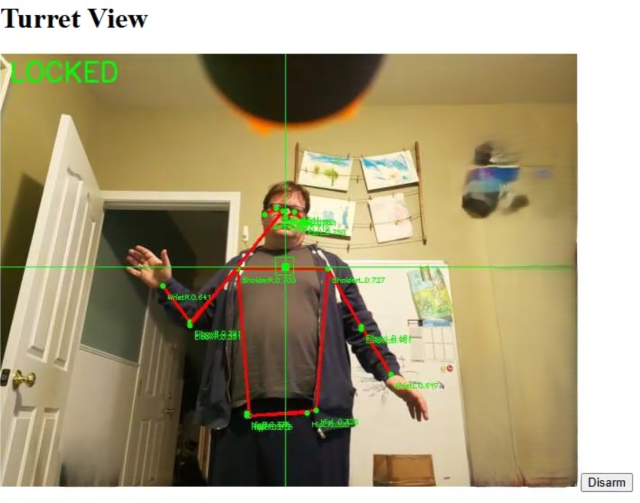
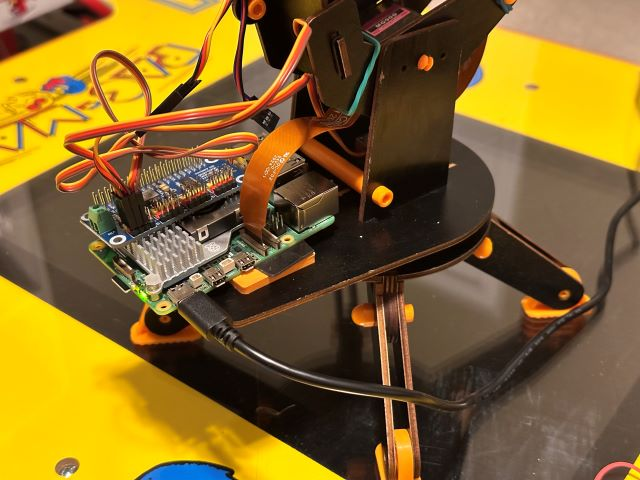
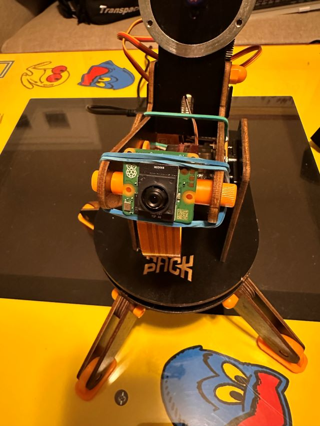

# pyturret

This is a python app to turn a [HackPack Turret](https://www.crunchlabs.com/products/ir-turret) into an AI powered sentry gun.

This runs on a Raspberry pi and uses the [AI Camera](https://www.raspberrypi.com/products/ai-camera/) to search for, track and fire at human-shaped targets.  It can track multiple targets and fire on them in sequence (sometimes).

The python application hosts a simple web page with a video stream of what the turret is seeing, overlayed with target information and basic info about the turret's state.  Simple controls are available on the web page to arm and disarm the turret (others, like manual control, could be added).


Most of the heavy lifting is done by the AI Processor on the IMX500, so the CPU load on the pi ends up being quite small.

## Hardware:
You can use the Raspberry PI's built-in hardware PWN to control the servos or pick up a PWM Hat. The PWM Hat makes wiring easier and simplifies the software setup.  To use the pi's pwm directly you will definitely need to use hardware PWM, software will cause all kinds of jitter in the servos.  The pi 5 has 4 hardware PWM channels available so it will work, earlier models may have less.

I just removed the stock Arduino and plastic holder-thingy and stuck the pi down with some double-sided foam tape.  The camera is attached to the front of the turret with a rubber band and the ribbon cable is threaded under the main body to the pi.





## Software:
### Installation
This should be pretty straightforward to get running on a raspberry pi with recent OS.  You'll need to install the camera software from Raspberry Pi and then create a python virtual environment to run the code.

NOTE: The venv must include raspberry pi system packages in order for picamera2 to work correctly.
```
python3 -m venv venv --system-site-packages
source venv/bin/activate`
pip install -r requirements.txt
```

### Usage
Run `python3 main.py` and the turret will start.  Some info is logged to the terminal and a web server is started on port 8000 of your raspberry pi.  If you named your pi "turret" when you burned the SD card you can probably access it at http://turret.local:8000/

Note: I really like to use Visual Studio Code's remote SSH workspace feature to work on this project.  Just point it at the folder on your pi and you get a really nice development environment where you can run the code in a debugger to see what's going on, run terminal commands, etc.  And you can run VS Code locally on your desktop so everything feels snappy (as opposed to running it on the pi which usually lags pretty badly).


# Enhancement Ideas
* Use a speaker and an LLM to give it a "personality" (maybe like the turrets from Portal?).  Bonus points: include a microphone so targets can interact with it.  I understand that speech-to-text is still a relatively expensive process computationally but there are APIs to handle it.
* The tracking of multiple targets is still pretty shaky.  It would be nice to be able to "tag" a given target and track it over its lifetime, I'm not sure how much of this the current vision model supports though (it might be doable).
* The yaw servo is overloaded.  Some gearing or a stepper motor would be a big help, especially when trying to make small moves.  Sometimes it can't lock on because it's trying to adjust the servo just a smidge but it won't move unless you give it a big delta.
* An actual proper control loop for the tracking would be really cool.  You could do things like leading moving targets if you had some kind of PID and position estimation (maybe?).

# History
I went through a few iterations of this hack:
### Tethered
First I used a USB webcam mounted on the turret and connected to my PC.  I did all the vision processing on my PC and sent commands back to the turret via serial.  I discovered that "pose estimation" is the process of taking a video stream and locating human-like figures in it, there are multiple free/open source models available to do this.  I did a quick hack of the original arduino turret code to accept serial commands instead of IR and it all worked pretty well.  I added some text-to-speech stuff to make it say "Searching", "Locked On" etc and the kids thought it was hilarious.
### Moving to the Raspberry PI
Next I decided it would be more fun if it wasn't tethered to my PC so I picked up a Raspberry Pi 5 and rubber banded it to the back of the turret.  I figured I'd need the processing power of the rpi 5, and I was right.  Using the same little USB webcam and most of the same code I was able to get the turret running autonomously.  At this stage I had to tackle what ended up being one of those huge dumb time syncs that sometimes crop up in projects like this: getting hardware PWM working on the pi to control the servos.  I eventually got it working but it took far far longer than it should have.  The Raspberry pi 5 has a whole new IO subsystem so a lot of the stuff you can find on the internet doesn't apply to the 5, and hardware PWM is just an esoteric enough topic that there isn't a ton of info out there.  This worked reasonably well but the PI CPU was pegged and it was generating a LOT of heat.  I added the official pi active cooler but I was still worried about overheating.
### The AI Camera
At some point I stumbled on the [Raspberry Pi AI Camera](https://www.raspberrypi.com/products/ai-camera/) and decided to give it a try.  I had to completely rewrite my code but it turned out to be a great fit for this project.  The AI camera has an "AI Coprocessor" built right into the camera module and they publish neural networks you can upload to it in order to do things like object detection and, luckily for my purposes, pose estimation.  Around this time I also added a web server to stream the video from the camera, previously I had been using a VNC session to view it "locally" on the pi but the stream worked out great.  This was one of those "vibe coding" things where I just told Copilot to "make a web server that will stream the video from the camera" and it almost/kinda "just worked" (after I fixed a bunch of bugs and rewrote a chunk of it... but it got me on the right track).

So in its final form the turret can track multiple targets and fire once it's "locked on" to one person for 1.5 seconds.  Then it will switch to the next available target and repeat.  If it can't find any targets it goes into a search mode where it just scans back and forth looking for targets.  The video feed with targeting overlays is streamed to a web page hosted from the raspberry pi so I can view it from any pc or phone on my home network.